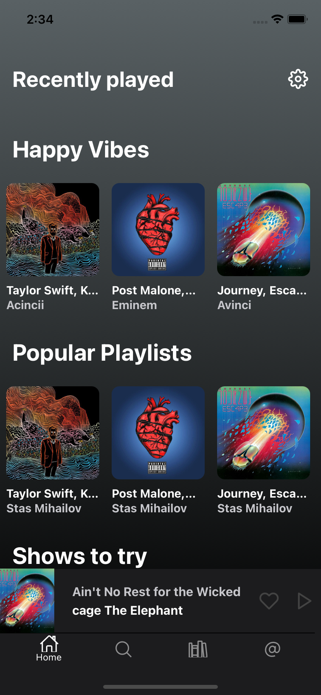
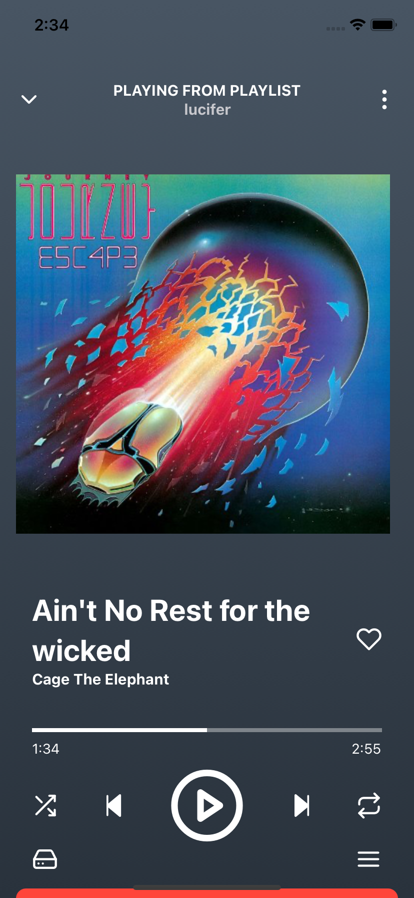
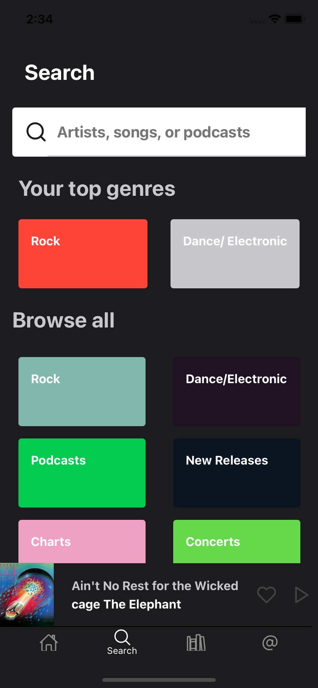
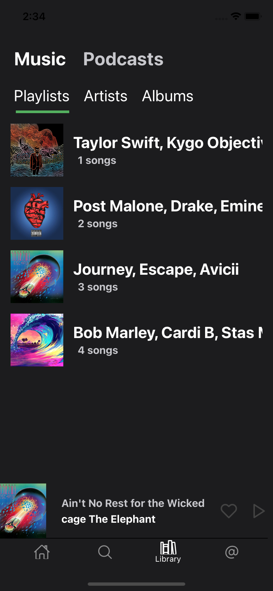
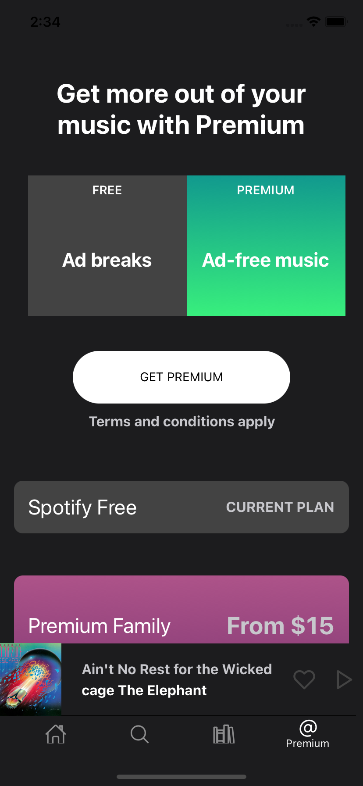
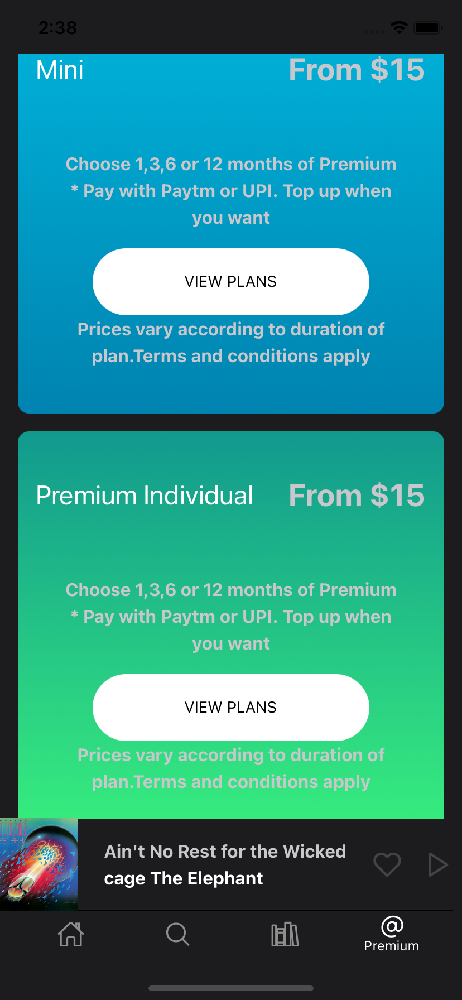

# spotify-clone

</hr>

# Screenshots








# Install

    Android - Android apk download
    IOS - Since it is an expo project you can get it easily
    Web -  Working on it To bring web support as well

# Features

- [x] Home Screen
- [x] Search Screen
- [x] Library Screen
- [x] Play Screen
- [ ] Animation in play screen
- [x] Premium Screen
- [ ] API
- [ ] Add local songs

# Contributing

Run the following to start expo project

```
    yarn run web
```

To run android:

```
    yarn run android
```

To run ios:

```
    yarn run ios
```

# Hire

</hr>
Looking for a React/React-Native Developer ? Email at <a href="#">dev.adityakmr@gmail.com</a>

</hr>

# License

MIT
